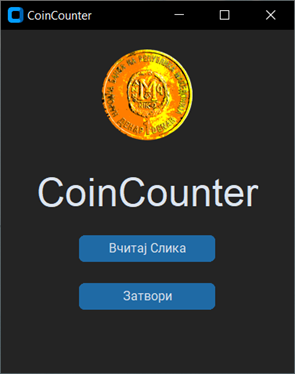
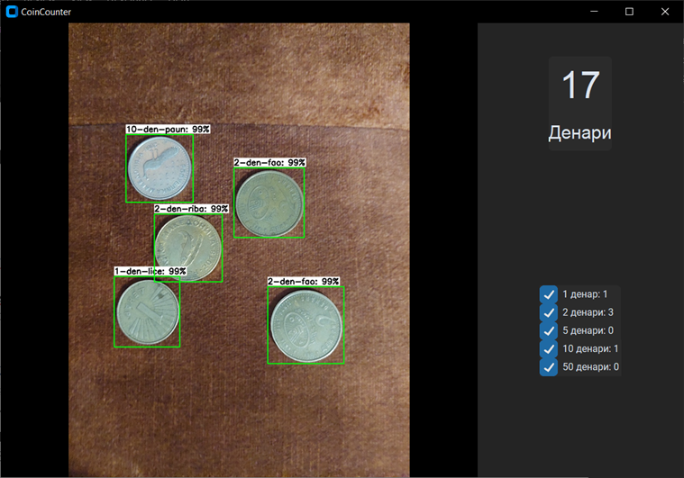

# CoinCounterGUI

<hr>
Coin detection, recognition, and calculation of total value. Detection and recognition using ssd-mobilenet-v2-fpnlite-320 TensorFlow model. Image manipulation with OpenCV. GUI made with CustomTKinter.

## Installation

1. Clone this repository:

    ```
    git clone https://github.com/yourusername/coincounter.git
    ```

2. Navigate to the project directory:

    ```
    cd coincounter
    ```

3. Install the required Python packages:

    ```
    pip install -r requirements.txt
    ```

## Usage

1. Run the CoinCounter app:

    ```
    python main.py
    ```
   
2. Using the GUI load a picture by clicking on "Вчитај Слика"

 
4. When a picture is selected you will see the picture with a bounding box around every coin, and the total sum given in the upper right corner

5. Additionaly, you can set the bounding box to be displayed only for the preffered coin denomination by unselecting the checkmark on the right side near the coin count by denomination
